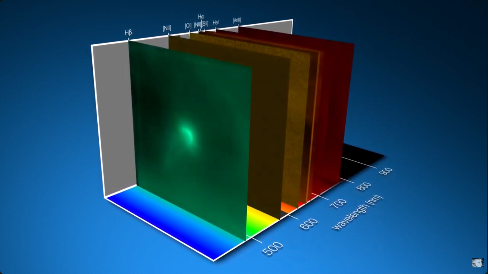

Hey, I'm Bob.

Currently, I'm a CTO Advisor/Consulting Architect @ Highspring Labs, helping organizations leverage AI to transform their product delivery and customer experiences – but only when traditional software development won't cut it.

My journey's been wonderfully non-linear: from building hardware/software systems for medical researchers and testing silicon for the 68040 processor, to recently earning my M.S. in Physics from NCSU (2024). While there, I worked in observational astrophysics, studying distant celestial objects through the stories their light tells us. The below animation from ESO shows the type of analysis we were doing in a beautiful way (a tiny 64x64 pixel patch of sky, across a range of 2000 different wavelengths).

I'm a builder at heart – whether it's coding in React and Python, designing systems architecture, or creating in Blender. Each career pivot has added a unique perspective to how I approach problems and innovation.

---

## Changelog

0.0.2

### Release Notes

#### v0.0.2 (2026-04-20)

- docs: add Orion Nebula thumbnail and link YouTube video in README [`26c1349`]

#### v0.0.1 (2026-04-18)

- chore: add preview animation GIF to media directory [`0e40ba8`]
